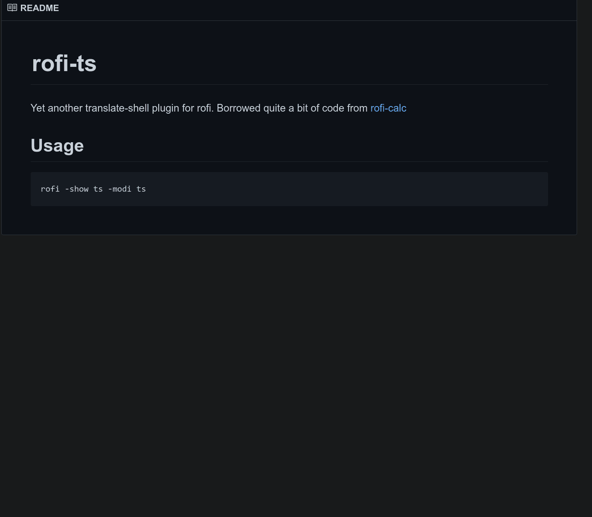

# rofi-ts

Yet another translate-shell plugin for rofi. Borrowed quite a bit of code from [rofi-calc](https://github.com/svenstaro/rofi-calc)




## Usage

```bash
rofi -show ts -modi ts
```

Type the sentence to translate. By default, translate-shell guesses the language to translate from, and translates it to your system locale.

You can prefix your query with language info:

- `fr:en Bonjour` will translate 'Bonjour' from french to english
- `:fr Hello` will translate 'Hello' from your locale to french
- `fr: Nombre` will translate 'Nombre' from french to your locale

## Advanced Usage

```bash
rofi -show ts -modi ts -ts-command "notify-send 'rofi-ts' '{result}'"
```

This will show a notification with the translation result.


